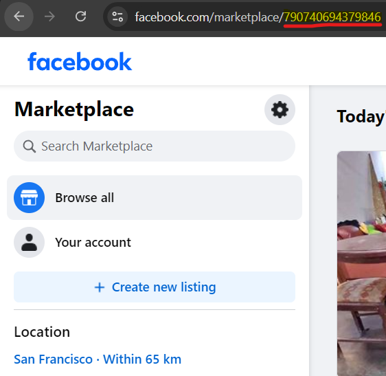

# Facebook Marketplace Scraper for free items in your city

## Description :
This program scrapes Facebook Marketplace for free items in your area and sends the listings on a discord server.
You need a discord bot that can send messages on channels.

### To run whis program you first need to :
<ol>
  <li>Have an installed version of the Google Chrome web browser</li>
  <li>Create your own .env file with the parameters :</li>
    <ol>
        <li>DISCORD_TOKEN = <em>your own</em></li>
        <li>FREE_MISC_CHANNEL_ID = <em>your own</em></li>
        <li>FREE_FURNITURE_CHANNEL_ID = <em>your own</em></li>
        <li>FREE_UNWANTED_CHANNEL_ID = <em>your own</em></li>
        <li>FACEBOOK_MARKETPLACE_LOCATION_ID = <em>The facebook marketplace Id for your city</em> (See image below for exemple)</li>
    </ol> 
  <li>Run command following command to install requirements : pip install -r requirements.txt</li>
</ol> 

 

#### How to find Facebook Marketplace city Id : 
Select the city of your choosing the marketplace and copy the value that is highlighted in the image below.

### Future Potential Features :
<ol>
  <li>test unwanted word followed by "." or other characters</li>
  <li>Create install executable that auto install requirements and runs in background</li>
  <li>Add listing categorisations (outdoors, tools, computers, etc.) with AI (image or text based) </li>
</ol> 