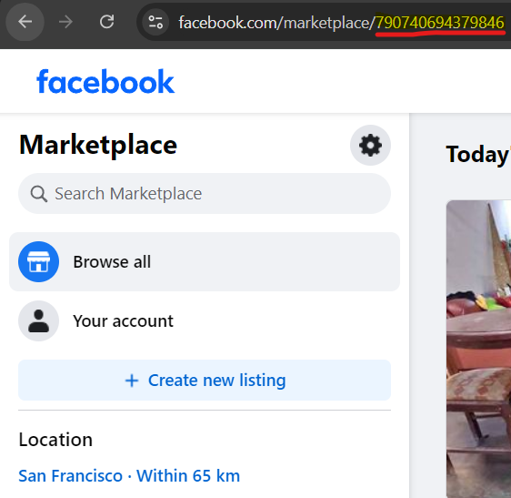

# Facebook Marketplace Scraper for free items in your city

## Description :
This program scrapes Facebook Marketplace for free items in your area and sends the listings on a discord server.
You need a discord bot that can send messages on channels.

## Prerequisites :
- Docker and Docker Compose (recommended) **OR**
- Python 3.11+ with virtual environment
- Firefox browser (for local development)

---

## Setup Instructions

### 1. Create your `.env` file

Create a `.env` file in the project root with the following parameters:

```env
DISCORD_TOKEN=your_discord_bot_token
FREE_WANTED_CHANNEL_ID=your_channel_id
FREE_MISC_CHANNEL_ID=your_channel_id
FREE_HOME_CHANNEL_ID=your_channel_id
FREE_UNWANTED_CHANNEL_ID=your_channel_id
FACEBOOK_MARKETPLACE_LOCATION_ID=your_city_location_id
```

### 2. Find your Facebook Marketplace City ID

Select the city of your choosing in the marketplace and copy the value highlighted in the image below:



---

## Running with Docker Compose (Recommended)

**Best for production, Raspberry Pi, and ARM devices**

### Build and run:
```bash
docker compose up -d --build
```

### View logs:
```bash
docker compose logs -f
```

### Stop the container:
```bash
docker compose down
```

### Rebuild after code changes:
```bash
docker compose build --no-cache
docker compose up -d
```

---

## Running with Docker (Without Compose)

### Build the image:
```bash
docker build -t marketplace-scraper:latest .
```

### Run the container:
```bash
docker run -d --env-file .env --name marketplace-scraper --restart unless-stopped marketplace-scraper:latest
```

### View logs:
```bash
docker logs -f marketplace-scraper
```

### Stop and remove:
```bash
docker stop marketplace-scraper
docker rm marketplace-scraper
```

---

## Running Locally (Development)

**For local development and testing**

### 1. Install Firefox browser
- Download from: https://www.mozilla.org/firefox/

### 2. Create a virtual environment and install dependencies:

**Windows:**
```bash
python -m venv .venv
.\.venv\Scripts\activate
pip install -r requirements.txt
```

**macOS/Linux:**
```bash
python3 -m venv .venv
source .venv/bin/activate
pip install -r requirements.txt
```

### 3. Run the application:
```bash
python src/main.py
```

---

## Raspberry Pi Deployment

This project is ARM-compatible and optimized for Raspberry Pi:
The Dockerfile automatically detects ARM architecture and installs the correct Firefox + geckodriver versions.

---

## Troubleshooting

### Check container logs:
```bash
docker logs marketplace-scraper
# or with compose
docker compose logs -f
```

### Verify geckodriver version:
```bash
docker exec marketplace-scraper /usr/local/bin/geckodriver --version
```

### Restart the container:
```bash
docker restart marketplace-scraper
# or with compose
docker compose restart
```

---

## Future Potential Features :
<ol>
  <li>Reverse image finder on Google, and find price of product (send message to different channel when profit is high)</li>
  <li>Add filtering options for specific item categories</li>
  <li>Web dashboard for configuration</li>
</ol>